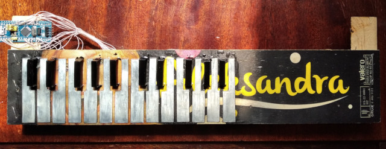

# What is this?

This is project of DIY USB 25-keys MIDI sensor keyboard using stm32f103c8t6 (bluepill).

Video with test: https://www.youtube.com/watch?v=1aOL8qs3DmQ

# How this works? 🤔

All piano keys is a capacitive touch sensors.
The microcontroller continuously measure needed time for change pin state from 0 to 1 and and back
That's have little lag, because any gpio pin have parasitic capacitance.
And when finger touches pin there is a current leak happens and time to charge/discharge changes.

The algorithm is simple:
1. Change pin to input with internal pull-up
2. Measure time until pin have `1` state
3. Change pin to output=1 for complete charge parasitic capacitor
4. Change pin to input with internal pull-down
5. Measure time until pin have `0` state
6. Change pin to output=0 for complete discharge parasitic capacitor

Any deviations in these measured times is meaning for key press.

# Shematic


Just connect piece of foil to microcontroller. And that's all, lol.

Current pinout which use in the code:

|Pin|Note|
|---|---|
|PB13|C3|
|PB14|C3#|
|PB15|D3|
|PB12|D3#|
|PA8|E3|
|PB8|F3|
|PB9|F3#|
|PB7|G3|
|PB3|G3#|
|PA1|A3|
|PB1|A3#|
|PA0|B3|
|PB4|C4|
|PB0|C4#|
|PA7|D4|
|PA2|D4#|
|PA4|E4|
|PB5|F4|
|PB11|F4#|
|PA5|G4|
|PA15|G4#|
|PA3|A4|
|PA6|A4#|
|PB6|B4|
|PB10|C4|

But you can connect keys in any random order and just generate new `App::m_pins` using `DEBUG_SORT_KEYS=true` mode.

That's exactly what I did 🤦‍♂️

# Hardware design

I use keys cut from tin and these mounted to part of fruit box 🤦‍♂️

All keys lacquered for isolation. That important if you don't want to fried your MCU.



(See full size: [docs/device-photo.jpg](docs/device-photo.jpg))

To simplify this I wrote piano-layout generator in php: [gen-piano.php](gen-piano.php)

Usage:
```bash
# gen-piano.php <number of keys>
php gen-piano.php 25
```

For example, layouts for 25-keys MIDI for this project:
- Black keys layout for cutting: [docs/piano-black-keys-for-cut.png](docs/piano-black-keys-for-cut.png)
- White keys layout for cutting: [docs/piano-white-keys-for-cut.png](docs/piano-black-keys-for-cut.png)
- Drill layout: [piano-drill-map.png](piano-drill-map.png)

All of these images have 300 ppi resolution. Just print and cut! :)

# Configuration

Okay you built this device. And as expected, nothing works. Oh no, this is scam???? 😱

No, that's okay. Different constructions have different parameters and my settings maybe not suitable for you. 

Mainly, you need tune these parameters for your device:
| Parameter | Default | Description |
|---|---|---|
| SENSOR_WHITE_KEY_THRESHOLD | 1000 | Threshold for white key, at which deviation (in %) will mean key is pressed.<br>This value in percentages multiplied to 100.<br>100000=100%|
| SENSOR_BLACK_KEY_THRESHOLD | 1000 | Threshold for black key, at which deviation (in %) will mean key is pressed.<br>This value in percentages multiplied to 100.<br>100000=100%|

Other parameters:
| Parameter | Default | Description |
|---|---|---|
| NOTE_OFFSET | 48 | MIDI note for first key: 36 - C2, 48 - C3<br>See for more info: https://studiocode.dev/resources/midi-middle-c/ |
| KEY_VELOCITY | 64 | Velocity of key press |
| DEBOUNCE_CYCLES | 1000000 | Time for debounce. Value in the cpu cycles. This value used to reduce  jittering keys state. |
| CALIBRATION_CYCLES | 100 | Cycles for measure average capacitance for initial state. |
| SAMPLES_CNT | 8 | Cycles for averaging measured capacitance |
| DEBUG_SORT_KEYS | false | Debug mode for generatin new `App::m_pins` in right order |
| DEBUG_PRESS_KEYS | false | Debug mode for tune thresholds |

You can find all of these parameters in [src/App.h](src/App.h)

# Build firmware

You need arm-none-eabi compiler for arm: https://developer.arm.com/downloads/-/gnu-rm

```bash
git clone https://github.com/Azq2/stm32-sensor-midi-keyboard
cd stm32-sensor-midi-keyboard
./build_libopencm3.sh
make
```

After this you have `app.bin` and `app.elf`. Just flash one of this in any appropriate way.

In case of [BlackMagic Probe](https://github.com/blackmagic-debug/blackmagic) you can simply flash using this command:
```bash
make install
```

# How to use?

Just connect to USB and it works. I love linux for this.

I really don't know what actions needed for windows/osx :)

# Debug

I use USART1 for debug output. Connect any USART-to-USB adapter to these pins:

| MCU | USART-to-USB |
|---|---|
| PA9 (TX) | RX |
| PA10 (RX) | TX |
