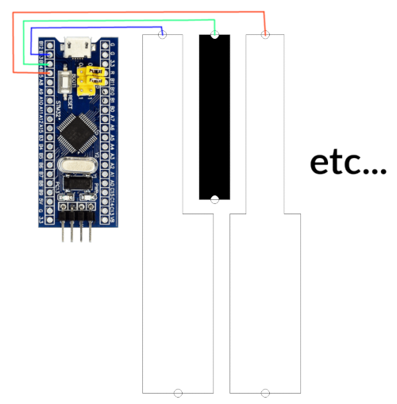

# stm32-sensor-midi-keyboard

# How that works? 🤔

All piano keys is a capacitive touch sensors.
The microcontroller continuously measure needed time for change pin state from 0 to 1 and and back
That's have little lag, because any gpio pin have parasitic capacitance.
And when finger touches pin there is a current leak happens and time to charge/discharge changes.

The algorithm is simple:
1. Change pin to input with internal pull-up
2. Measure time until pin have `1` state
3. Change pin to output=1 for complete charge parasitic capacitor
4. Change pin to input with internal pull-down
5. Measure time until pin have `0` state
6. Change pin to output=0 for complete discharge parasitic capacitor

Any deviations in these measured times is meaning for key press.

# Shematic

Just connect piece of foil to microcontroller. And that's all, lol.

Current pinout which use in the code:

|Pin|Note|
|---|---|
|PB13|C3|
|PB14|C3#|
|PB15|D3|
|PB12|D3#|
|PA8|E3|
|PB8|F3|
|PB9|F3#|
|PB7|G3|
|PB3|G3#|
|PA1|A3|
|PB1|A3#|
|PA0|B3|
|PB4|C4|
|PB0|C4#|
|PA7|D4|
|PA2|D4#|
|PA4|E4|
|PB5|F4|
|PB11|F4#|
|PA5|G4|
|PA15|G4#|
|PA3|A4|
|PA6|A4#|
|PB6|B4|
|PB10|C4|

But you can connect key in any random order and just generate new `App::m_pins` using `DEBUG_SORT_KEYS=true` mode.

That's exactly what I did 🤦‍♂️

# Configuration

Okay you built this device. And as expected, nothing works. These is scam???? 😱

No, that's okay. Different constructions have different parameters and my settings maybe not suitable for you. 

Mainly, you need tune these parameters for your device:
| Parameter | Default | Description |
|---|---|---|
| SENSOR_WHITE_KEY_THRESHOLD | 1000 | Threshold for white key, at which deviation (in %) will mean key is pressed. This value in percentages multiplied to 100. 100000=100%|
| SENSOR_BLACK_KEY_THRESHOLD | 1000 | Threshold for black key, at which deviation (in %) will mean key is pressed. This value in percentages multiplied to 100. 100000=100%|

Other parameters:
| Parameter | Default | Description |
|---|---|---|
| NOTE_OFFSET | 48 | MIDI note for first key: 36 - C2, 48 - C3 See for more info: https://studiocode.dev/resources/midi-middle-c/ |
| KEY_VELOCITY | 64 | Velocity of key press |
| DEBOUNCE_CYCLES | 1000000 | Time for debounce. Value in the cpu cycles. This value used to reduce  jittering keys state. |
| CALIBRATION_CYCLES | 100 | Cycles for measure average capacitance for initial state. |
| SAMPLES_CNT | 8 | Cycles for averaging measured capacitance |
| DEBUG_SORT_KEYS | false | Debug mode for generatin new `App::m_pins` in right order |
| DEBUG_PRESS_KEYS | false | Debug mode for tune thresholds |

You can find all of these parameters in [src/App.h](src/App.h)
